# 🌿 Plant Solution

**Official Website:** [https://plantsolutions.netlify.app](https://plantsolutions.netlify.app)

**Developer:** Ashish Tiwari

**🏆 Award:** Hackmore 2024 — **2nd Place**

---

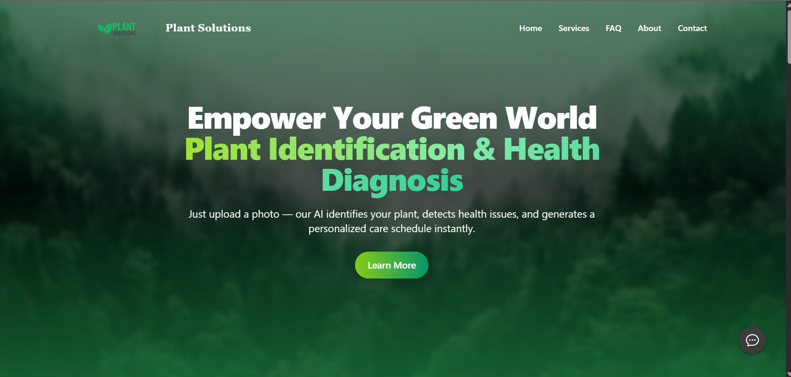


> **Plant Solution** — Fast, secure, and user-friendly web application that provides instant plant identification, plant health & infection analysis, and personalized weekly care schedules — all for free.

---

## ✨ Highlights

* ✅ **Instant Plant Identification** — Upload a single leaf image and get taxonomy, edible parts, common names, scientific details, a concise summary and a reference link to Wikipedia.
* ✅ **Plant Health & Infection Detection** — Upload an infected leaf image to receive infection name, infection percentage, and actionable prevention suggestions.
* ✅ **Personalized Care Scheduler** — Enter your plant's name and get a **free weekly care schedule** (watering, sunlight, fertilization hints, etc.).
* ✅ **Free Usage** — Up to **5 requests per service per day** for every user.
* ✅ **Fast & Secure** — Built with a custom API layer, robust security policies, and rate-limiting to protect resources.
* ✅ **Modern UI/UX** — Responsive design using React, Tailwind CSS, and Framer Motion for smooth interactions.

---

## 🔍 Features & UX

* **Single-click uploads** for fast detection and identification.
* **Clear results page** with summarized scientific information and a high-quality reference image.
* **Actionable prevention tips** with infection percentage meter to help growers decide urgency.
* **Simple care calendar** tailored to the specific plant species — weekly reminder-style schedule.
* **Lightweight, accessible, and mobile-first** design.

---

## 🧭 How It Works (User Flow)

1. **Identify** — Upload a single leaf image → get taxonomy, common name, edible part, short description, and a summary image.
2. **Diagnose** — Upload a leaf showing symptoms → get infection detection percentage, identified disease name, and prevention suggestions.
3. **Schedule** — Enter the plant name → get a 7-day care schedule (water, sunlight, fertilize, tips).

---

🧩 Technologies Used
<p align="center">        </p>

## ⚙️ Technology Stack
* **Frontend:** React.js, Tailwind CSS, Framer Motion
* **Backend / API:** Node.js (Express) — custom API layer
* **Model / Detection:** Custom model endpoints (hosted separately or via secure inference API)
* **Hosting:** Netlify (Front-end) + Custom API (secure endpoint)
* **Other:** JSON-LD for structured data, optimized images, lazy-loading for performance

---

## 🔐 Security & Policies

* **Rate limiting**: Per-user rate limiting to protect APIs — default: **5 requests/service/day**.
* **CORS & CSP**: Strict Content Security Policy + allowed origins whitelist for APIs.
* **Input validation**: Images validated for file type, size, and scanned for common threats.
* **No user data sale**: Privacy-first approach — no selling of user images or PII.
* **GDPR friendly**: Users can request data removal via contact.

---

## 🧪 API (Overview for Developers)

> **Note:** These are descriptive endpoints used by the frontend. The real endpoints may be behind auth and security rules.

* `POST /api/identify` — Upload image (multipart/form-data) → returns taxonomy, commonName, ediblePart, summary, wikiUrl, summaryImageUrl
* `POST /api/diagnose` — Upload image (multipart/form-data) → returns infectionName, infectionConfidence, preventionTips, additionalResources
* `POST /api/schedule` — `{ "plantName": "Ficus lyrata" }` → returns 7-day care schedule JSON
* `GET /api/credits` — Returns remaining free requests and rate-limit status for the user

**Response example (Identify):**

```json
{
  "taxon": "Ficus lyrata",
  "commonName": "Fiddle Leaf Fig",
  "ediblePart": "None",
  "summary": "Large-leafed indoor tree, popular as a houseplant.",
  "wikiUrl": "https://en.wikipedia.org/wiki/Ficus_lyrata",
  "imageUrl": "https://.../sample.jpg"
}
```

---

## 🖼️ Screenshots

**Homepage / Hero**

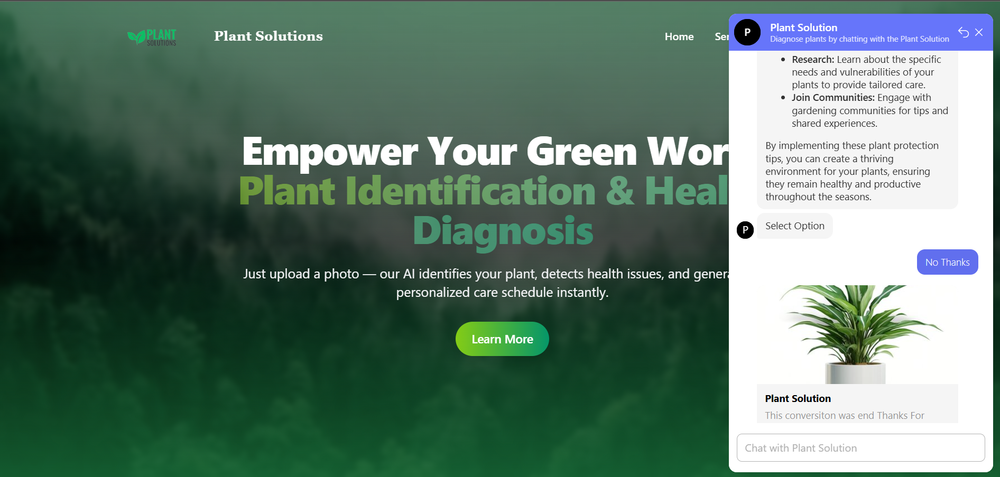

**Identify Result Example**

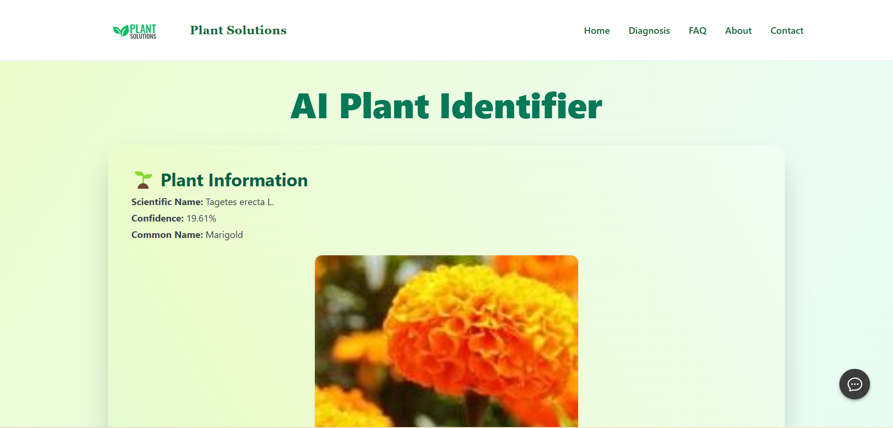
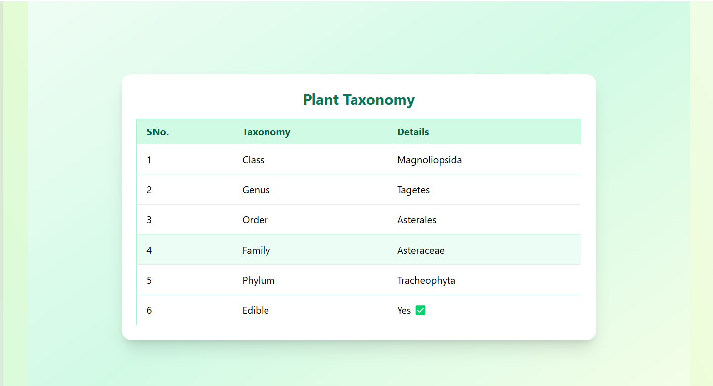
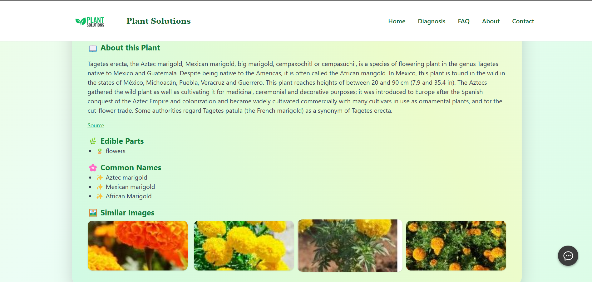

**Diagnose Result Example**

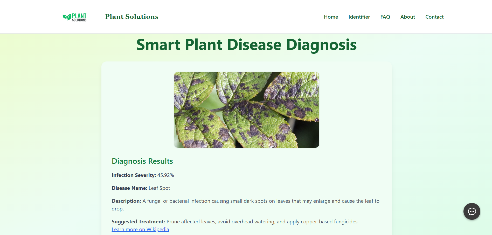
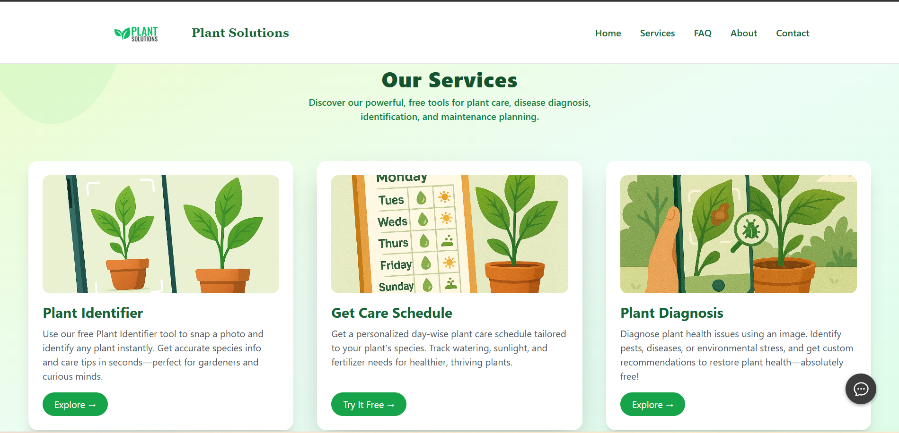

**Weekly Care Schedule**

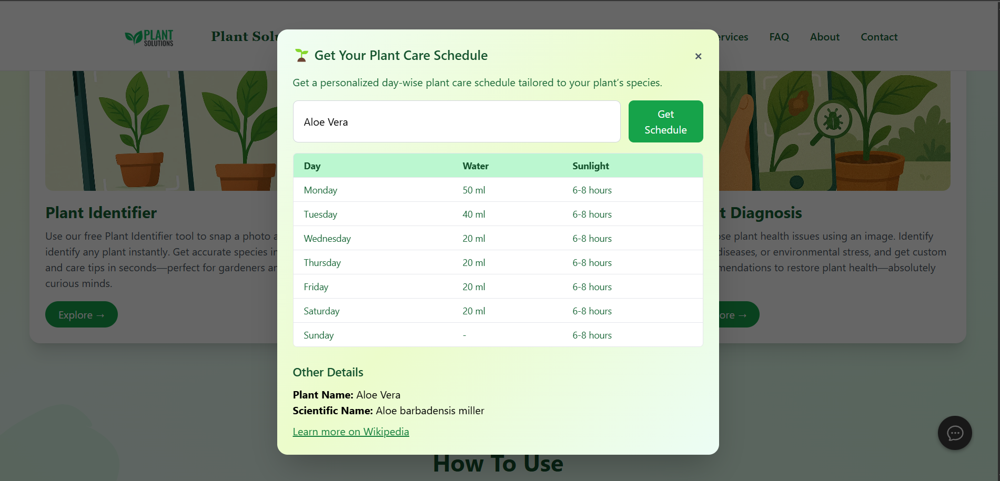
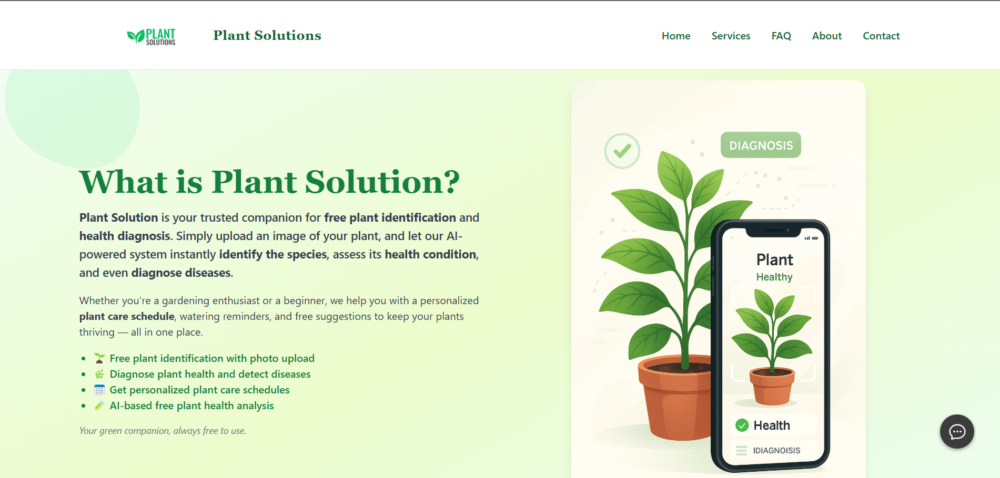

**AI Chat Bot**

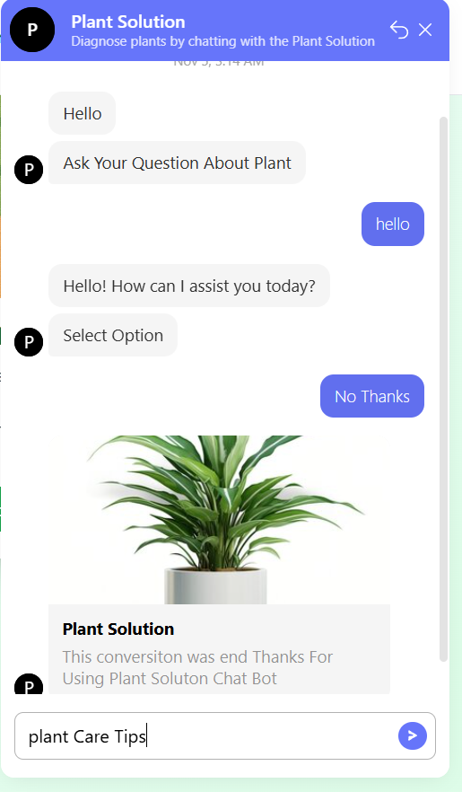
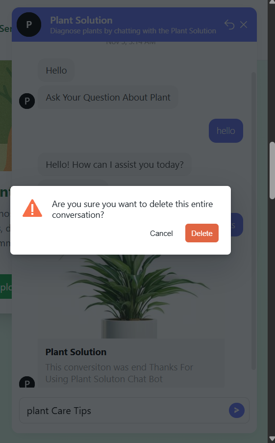

> Add your exported screenshots to the repo as: `screenshot-hero.png`, `screenshot-identify.png`, `screenshot-diagnose.png`, `screenshot-schedule.png`.

---

## 🚀 Quick Dev Setup (Local)

> Developer machine with Node.js and npm/yarn

```bash
# clone repo
git clone https://github.com/<your-username>/plant-solution.git
cd plant-solution

# install
npm install

# start dev server
npm run dev
```

**Environment variables** (example):

```
REACT_APP_API_URL=https://api.yourdomain.com
NODE_ENV=development
PORT=3000
```

---

## 📦 Deployment

* Frontend: Deploy on **Netlify** (drag & drop or connect GitHub repo)
* Backend: Deploy on secured endpoint (Heroku / Railway / Vercel Serverless or your own server)
* Configure CORS and CSP headers in production

---

## 💬 Credits & Contact

* **Project:** Plant Solution
* **Developer:** Ashish Tiwari
* **Website:** [https://plantsolutions.netlify.app](https://plantsolutions.netlify.app)
* **Award:** Hackmore 2024 — 2nd Place

For collaboration or data removal requests, contact: `anamikatiwari318@gmail.com`

---

## 📜 License

This project is released under the **MIT License**. See `LICENSE` for details.

---

*Made with ❤️ using React, Tailwind & a little plant-love.*
